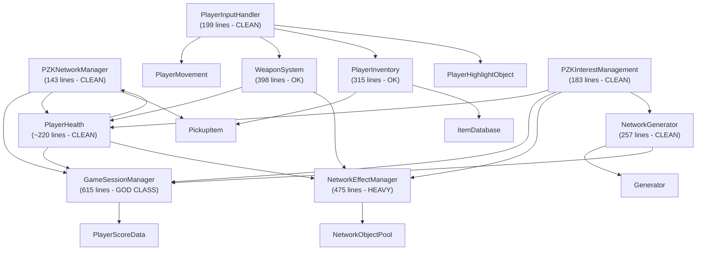

# PZK Beast Mode -- Codebase Audit & Production Roadmap

---

## TASK 1: CODEBASE DEEP-SCAN & DIAGNOSTIC

### 1.1 Inventory: 30 Unique Scripts

| Category | Count | Scripts |
|---|---|---|
| **Mirror NetworkBehaviour** | 14 | PZKNetworkManager, GameSessionManager, PlayerMovement, PlayerHealth, PlayerInventory, WeaponSystem, ServerMovementValidator, PlayerInputHandler, PlayerCameraController, PlayerUIController, PlayerHighlightObject, PlayerLobbyReady, NetworkEffectManager, NetworkGenerator, ItemSpawner, PickupItem |
| **MonoBehaviour (UI/Util)** | 8 | Generator, NetworkObjectPool, NetworkSyncDistance, GameSessionUI, PlayerHealthUI, InventoryUI, InventorySlot, PZKInterestManagement |
| **Data/Struct** | 4 | ItemData (SO), ItemDatabase (SO), ItemSlot (struct), PlayerScoreData (struct) |
| **DUPLICATE** | 1 | `playerMovement.cs` (lowercase) -- identical content to `PlayerMovement.cs` |

### 1.2 Network Architecture: Decoupling Analysis



**Verdict: One God Class, rest is well-decoupled.**

- `PZKNetworkManager` (143 lines): Lean. Lifecycle + respawn + cleanup. No bloat.
- `GameSessionManager` (615 lines): **GOD CLASS.** Owns 7+ responsibilities: state machine, timer sync, scoreboard (SyncList), ready system, kill tracking, transition coroutines, static UI helpers. This WILL collapse under Phase 4 additions (persistence, match-end flow, team logic).
- `NetworkEffectManager` (475 lines): Heavy but single-domain (VFX + SFX pooling + RPCs). Acceptable for now.
- `PlayerInputHandler`: Excellent decoupling via C# events. All consumers subscribe, none touch input directly.
- Player scripts: Well-separated (Movement, Health, Inventory, Camera, Weapon, UI, Highlight, LobbyReady each in own file).

### 1.3 Phase Completion Status

#### Movement (Prediction/Reconciliation) -- 85% Functional

| Component | Status | Detail |
|---|---|---|
| Client-side movement | DONE | `CharacterController.Move()` in `PlayerMovement.Update()`, ISO + FPS modes |
| Animation sync | DONE | `[SyncVar] walking/running` + `[Command] CmdSetMovementState` + hooks |
| Server validation | DONE | `ServerMovementValidator`: speed check (`maxAllowedSpeed`), teleport detection (`teleportThreshold`), rubber-banding via `[TargetRpc] TargetCorrectPosition` |
| Violation decay | DONE | `violationDecayInterval` timer resets counter naturally |
| **CSP (Client-Side Prediction)** | N/A | Not needed -- movement is client-authoritative with server validation overlay, not server-authoritative |
| **MISSING** | 15% | No ground-check validation (fly hack), no vertical speed cap, no `isGrounded` server check |

**Architecture**: Client owns position via `NetworkTransformReliable` (ClientToServer). Server watches passively in `FixedUpdate`, corrects only on violation. This is the correct pattern for Mirror -- full CSP would require custom snapshot buffer which is overkill here.

#### Combat (Authority/Lag Compensation) -- 65% Functional

| Component | Status | Detail |
|---|---|---|
| Server-authoritative hit detection | DONE | `CmdAttack(Vector3 aimDirection)` -> server `Physics.Raycast` from `transform.position + up * eyeHeight` |
| Cooldown enforcement | DONE | Server-side `attackCooldown` check in `CmdAttack` |
| Damage application | DONE | `PlayerHealth.TakeDamage(baseDamage, netIdentity)` -- server only |
| Attack animation sync | DONE | `[ClientRpc] RpcPlayAttackAnimation()` + local immediate trigger |
| Direction validation | PARTIAL | Validates `sqrMagnitude > 0.1f` but no angle-vs-forward check (client can aim behind them) |
| **Lag compensation** | **MISSING** | Server raycast at current-frame positions. At 100ms+ RTT, player aims at where target WAS, server checks where target IS NOW. Consistent misses on moving targets. |
| **Weapon variety** | **MISSING** | Single `baseDamage` int. `ItemData` has no weapon stats field. No `WeaponData` ScriptableObject. |
| **Damage feedback** | **STUB** | `TargetOnDamage` is a `Debug.Log` TODO. No directional indicator, no screen shake, no vignette. |
| **Kill feed** | **MISSING** | `RpcOnDeath(uint killerNetId)` logs to console only. No UI kill feed. |
| **Hit confirmation** | **MISSING** | Attacker gets no feedback that their hit landed. |

**Critical bottleneck**: `WeaponSystem.CmdAttack` does a single `Physics.Raycast` without any history rewinding. Mirror provides no built-in lag compensation -- this must be custom-built using snapshot buffers.

#### Game State (Timers/Global Sync) -- 90% Functional

| Component | Status | Detail |
|---|---|---|
| State machine | DONE | `GameState` enum: Lobby -> Warmup -> Active -> PostGame, server-authoritative transitions |
| Timer sync | DONE | `[SyncVar] timerEndTime` + `NetworkTime.time` -- zero per-frame traffic |
| Scoreboard | DONE | `SyncList<PlayerScoreData>` with kills, deaths, score, isReady |
| Ready system | DONE | `PlayerLobbyReady.CmdToggleReady` -> `GameSessionManager.ServerSetPlayerReady` -> auto-start check |
| UI integration | DONE | `GameSessionUI` (437 lines) event-driven via static C# events, no polling |
| Late-joiner support | DONE | SyncVars auto-sync on connect + `InitializeFromCurrentState()` in UI |
| **Match-end results screen** | **MISSING** | PostGame transitions back to Lobby after timer, no dedicated results display |
| **Map regeneration on round** | DONE | `NetworkGenerator.regenerateEachRound` flag, hooks into `OnGameStateChangedEvent` |

### 1.4 Technical Debt -- Top 3 Production Blockers

**DEBT #1: `GameSessionManager` is a 615-line God Class**

File: [GameSessionManager.cs](Assets/Scripts/GameSessionManager.cs)

7 distinct responsibilities in one class:
1. Singleton lifecycle (`Awake`, `OnDestroy`, `Instance`)
2. State machine (transitions, `ServerTransitionTo`, coroutines)
3. Timer system (`timerEndTime`, `timerRunning`, `ServerRunTimer`)
4. Scoreboard management (`SyncList<PlayerScoreData>`, `ServerRecordKill`)
5. Ready system (`ServerSetPlayerReady`, `ServerAreAllPlayersReady`)
6. Player registration (`ServerRegisterPlayer`, `ServerUnregisterPlayer`)
7. Static UI helpers (`GetStateLabel`, `FormatTime`)

**Impact**: Adding Phase 4 features (persistence, teams, match-end flow) to this class will push it past 1000 lines. Every modification risks breaking the state machine.

**DEBT #2: Combat has zero lag compensation**

File: [WeaponSystem.cs](Assets/Scripts/WeaponSystem.cs), method `CmdAttack`

The server raycast fires at `transform.position + Vector3.up * eyeHeight` using the target's current server-side position. The client aimed at where the target was `RTT/2` ago. At 80ms RTT, a target running at 4 m/s is ~16cm displaced. At 150ms RTT, ~30cm -- enough to whiff a melee hit at `attackRadius = 2.0f` range.

**Impact**: Combat will feel broken for any non-LAN connection. Phase 3 polish is pointless if hits don't register correctly.

**DEBT #3: `PickupItem.heldByNetId` dead code path + duplicate `playerMovement.cs`**

File: [PickupItem.cs](Assets/Scripts/Item/PickupItem.cs)

`heldByNetId` SyncVar is declared with a full `AttachToHolder`/`Detach` system (LateUpdate tracking, hand bone following, collider toggling), but **nothing in the codebase ever assigns a non-zero value to it**. The actual pickup flow (`PlayerInventory.CmdPickupItem`) destroys the world object via `NetworkServer.Destroy`. This is either dead code from a previous design or an incomplete secondary path. Either way, it's 100+ lines of unused logic that will confuse anyone touching the item system.

Additionally, `playerMovement.cs` (lowercase) and `PlayerMovement.cs` (uppercase) both exist with **identical content**. This breaks on case-sensitive filesystems (Linux CI/CD, dedicated servers) and causes Unity meta file conflicts.

---

## TASK 2: THE "BEAST MODE" ROADMAP

### Current State Summary

```
Phase 1 (Stabilization):     ████████████████████  100%  DONE
Phase 2 (Gameplay Loops):    ████████████████████  100%  DONE
Phase 3 (Polish/Feedback):   ██████████████░░░░░░   70%  IN PROGRESS
Phase 4 (Meta/Persistence):  ░░░░░░░░░░░░░░░░░░░░    0%  NOT STARTED
Phase 5 (Hardening):         ██░░░░░░░░░░░░░░░░░░   10%  PARTIAL (IM + ServerMovementValidator)
```

---

### PHASE 3: Polishing & Advanced Feedback (2-3 weeks)

**Pre-req**: Decompose `GameSessionManager` first (Debt #1 fix).

#### 3.1 GameSessionManager Decomposition (MUST -- 1 day)

Split [GameSessionManager.cs](Assets/Scripts/GameSessionManager.cs) into:
- `GameSessionManager.cs` (~150 lines) -- State machine transitions only, singleton, events
- `SessionTimerController.cs` (~80 lines) -- Timer SyncVars, `ServerRunTimer` coroutine, `RemainingTime`
- `SessionScoreboard.cs` (~120 lines) -- `SyncList<PlayerScoreData>`, `ServerRecordKill`, `TryGetPlayerScore`, registration
- `SessionReadySystem.cs` (~80 lines) -- `ServerSetPlayerReady`, `ServerAreAllPlayersReady`, ready state events

All four sit on the same NetworkIdentity GameObject. `GameSessionManager` references the others via `GetComponent` cached in `Awake`.

#### 3.2 Damage Feedback System (MUST -- 2-3 days)

Create `PlayerDamageFeedback.cs` (new, on player prefab):
- Directional damage indicator (UI arrows pointing toward attacker)
- Screen vignette (red pulse on damage, controlled by `TargetOnDamage`)
- Screen shake (camera offset lerp, decay over 0.3s)
- Hit confirmation for attacker: new `[TargetRpc] TargetHitConfirmed(NetworkConnectionToClient target)` in `WeaponSystem` sent to attacker on successful `TakeDamage`
- Hook into existing `PlayerHealth.TargetOnDamage` (currently a TODO `Debug.Log`)

#### 3.3 Kill Feed UI (MUST -- 1 day)

Create `KillFeedUI.cs` (scene Canvas):
- Driven by new `[ClientRpc] RpcBroadcastKill(string killerName, string victimName)` in `GameSessionManager` (or new `SessionScoreboard`)
- Pool of 5-8 kill feed entries, auto-fade after 5s
- Format: `"KillerName eliminated VictimName"`

#### 3.4 Death & Respawn Camera (SHOULD -- 1 day)

Modify `PlayerHealth.OnIsDeadChanged` hook:
- On death: switch to spectator/overhead camera, show "Respawning in Xs" overlay
- On respawn: flash effect (already has `RpcOnRespawn` -> `RespawnFlash` effect), restore camera

#### 3.5 NetworkEffectManager Prefab Hookup Audit (SHOULD -- 0.5 day)

Verify that all `NetworkEffectType` and `NetworkSoundType` enum entries in [NetworkEffectManager.cs](Assets/Scripts/NetworkEffectManager.cs) have assigned prefabs/clips in the Inspector. Currently the Manager has the infrastructure but may have empty definition slots for:
- `BloodSplatter`, `DeathEffect`, `RespawnFlash`, `HitFlesh`, `Death`, `Respawn`, `WeaponSwing`

#### 3.6 WeaponData ScriptableObject Integration (SHOULD -- 1-2 days)

Create `WeaponData.cs : ScriptableObject`:
- Fields: `damage`, `range`, `cooldown`, `attackType` (Melee/Ranged), `animationTrigger`
- Add `public WeaponData weaponData` field to [ItemData.cs](Assets/Scripts/Item/ItemData.cs)
- Modify `WeaponSystem` to read stats from the active slot's `ItemData.weaponData` instead of hardcoded `baseDamage` / `attackRadius` / `attackCooldown`

---

### PHASE 4: Meta & Persistence (3-4 weeks)

#### 4.1 Match-End Flow & Results Screen (MUST -- 2 days)

- In `PostGame` state: display full-screen results overlay (winner highlight, all player stats, KDA)
- New `MatchResultsUI.cs` driven by `GameSessionManager.OnGameStateChangedEvent`
- "Play Again" button (host) / "Return to Lobby" auto-timer (15s)
- Server resets scores on Lobby re-entry (already done in `ServerResetAllReadyStates`)

#### 4.2 Player Data Persistence -- Local First (MUST -- 3-4 days)

- Create `PlayerProfile.cs` (local JSON save): player name, cumulative stats, preferred loadout
- Create `PlayerProfileManager.cs` (singleton MonoBehaviour, not networked)
- Player name sent to server on connect via `[Command] CmdSetPlayerName(string name)` in a new `PlayerIdentity.cs`
- Server populates `PlayerScoreData.playerName` from this command (currently hardcoded `"Player_" + netId`)

#### 4.3 Lobby Enhancements (SHOULD -- 2-3 days)

- Player list UI with ready indicators (partially done via scoreboard, needs dedicated lobby panel)
- Countdown timer visible to all when all players ready (use Warmup phase)
- Map seed display / map vote (use `NetworkGenerator.ServerRegenerateWithSeed`)
- Min/max player configuration exposed in UI

#### 4.4 Scene Management (SHOULD -- 2 days)

- Evaluate: dedicated Lobby scene vs current single-scene approach
- If keeping single scene: add lobby area with spawn containment (invisible walls during Lobby state)
- If splitting: configure `PZKNetworkManager.offlineScene` / `onlineScene`, handle `ServerChangeScene`

---

### PHASE 5: Hardening (2-3 weeks)

#### 5.1 Lag Compensation for Combat (MUST -- 3-5 days)

This is the most complex single feature remaining. Implementation:

- Create `SnapshotBuffer.cs`: ring buffer storing `(double timestamp, Vector3 position, Quaternion rotation)` for each player, server-side
- `ServerMovementValidator.FixedUpdate` or a new `PositionHistoryRecorder` pushes snapshots every `FixedUpdate`
- In `WeaponSystem.CmdAttack`: read `connectionToClient.remoteTimeStamp` (Mirror provides this) to determine the client's estimated server time when they fired
- Rewind all target positions to that timestamp (interpolate between two nearest snapshots)
- Execute `Physics.Raycast` against rewound positions (use temporary collider repositioning or manual sphere/capsule checks)
- Restore positions after raycast
- Clamp rewind window to max 250ms to prevent extreme exploitation

Reference: Mirror's `NetworkTime.localTime` and `NetworkClient.connection.remoteTimeStamp` for timestamp estimation.

#### 5.2 Enhanced Server-Side Cheat Prevention (MUST -- 2 days)

Expand [ServerMovementValidator.cs](Assets/Scripts/ServerMovementValidator.cs):
- Add vertical speed validation (fly hack detection)
- Add `isGrounded` server check (requires syncing ground state or checking collider)
- Add damage rate limiting in `PlayerHealth.TakeDamage` (max N damage events per second per attacker)
- Add aim direction validation in `WeaponSystem.CmdAttack` (angle between client aim and server forward must be < 120 degrees)
- Add `[Server] void ServerBanPlayer(NetworkConnectionToClient conn, string reason)` in `PZKNetworkManager`

#### 5.3 Bandwidth Optimization (SHOULD -- 2 days)

- Tune `PZKInterestManagement.rebuildInterval` (currently using Mirror default -- profile at 8 players)
- Tune `NetworkSyncDistance.visibilityRange` per object type (items: 20m, effects: 40m)
- Profile `SyncList<PlayerScoreData>` -- if scoreboard updates are too frequent, batch via dirty flag + manual `ServerSendScoreboard` RPC at 1 Hz instead
- Consider `NetworkTransformReliable` send interval tuning per object type
- Add `[SyncVar]` change guards (skip sync if value unchanged) where Mirror doesn't already

#### 5.4 Stress Testing & Profiling (SHOULD -- 2-3 days)

- Create `BotSpawner.cs` (Editor/Dev only): spawns N headless bot players with random movement + periodic attacks
- Target: 8 players, 100 PickupItems, 30 tick/s, < 10 KB/s per player
- Profile with Unity Profiler + Mirror's `NetworkStatistics` component
- Document bandwidth per system (movement sync, SyncList updates, RPCs)

---

## IMMEDIATE CLEANUP (Before Phase 3 begins)

These take < 30 minutes total and prevent cascading issues:

1. **Delete** `playerMovement.cs` (lowercase duplicate) -- the `PlayerMovement.cs` (PascalCase) is the active file
2. **Delete or isolate** `PickupItem.heldByNetId` dead code path (the `AttachToHolder`/`Detach`/`LateUpdate` block) -- or document it as "reserved for future held-object-in-world feature"
3. **Rename** `itemSpawner.cs` to `ItemSpawner.cs` (file already has `public class ItemSpawner`)
4. **Guard** `ItemSpawner.SpawnInitialLoot` against empty `lootPrefabs` array (currently crashes with `IndexOutOfRangeException`)

---

## TASK 3: FIRST MASSIVE CODE BLOCK -- The Bridge to Phase 3

**Target: `PlayerDamageFeedback.cs`**

This is the single highest-impact file to implement because it:
1. Fills the biggest gameplay feel gap (combat feedback is currently silent)
2. Connects two completed systems (`WeaponSystem` + `PlayerHealth`) that have TODO stubs waiting for it
3. Requires zero architectural changes -- plugs into existing `TargetOnDamage` and `RpcOnDamage` hooks
4. Delivers visible progress across VFX, SFX, and UI simultaneously

The implementation should:
- Create `PlayerDamageFeedback.cs` (NetworkBehaviour on player prefab, ~250 lines)
- Add a `[TargetRpc] TargetHitConfirmed` to `WeaponSystem.CmdAttack` (3-line addition after successful `TakeDamage`)
- Replace the `Debug.Log` TODO in `PlayerHealth.TargetOnDamage` with calls to `PlayerDamageFeedback`
- Include: directional damage indicator arrows, red vignette pulse, camera shake, hit marker for attacker
- All visual effects are client-only (no bandwidth cost beyond the existing RPCs)

This single implementation block bridges "Phase 2 combat works mechanically" to "Phase 3 combat feels good to play."
