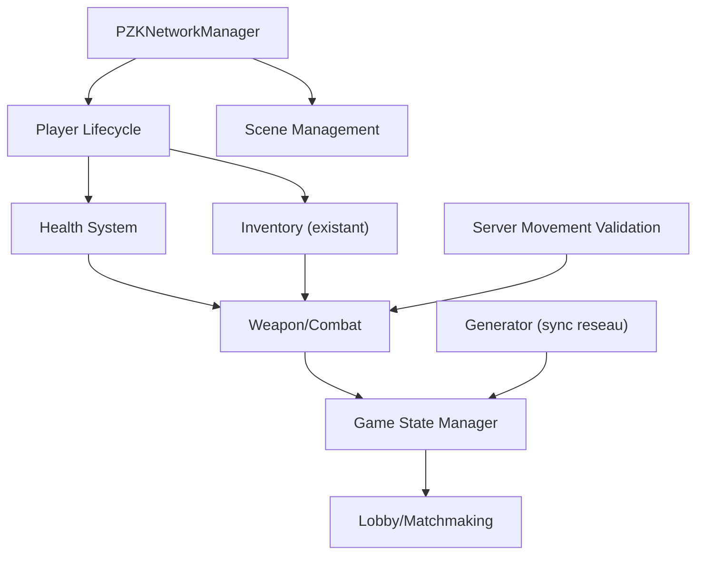

# FEUILLE DE ROUTE CRITIQUE -- PZK (Unity 6000.3 + Mirror LTS)

**Etat actuel** : 24 scripts projet, 10 Mirror-enabled, 14 non-reseau. Aucun systeme de sante, armes, game state, lobby, audio, ou pooling. Mouvement client-autoritaire. Failles de securite reseau actives.

---

## EVALUATION DE L'EXISTANT

### Scripts Mirror-enabled (10)

- `playerMovement.cs` (PlayerMovement) -- mouvement client-autoritaire, pas de validation serveur
- `PlayerInventory.cs` (PlayerInventory) -- SyncList + Commands, validation partielle correcte
- `PickupItem.cs` (PickupItem) -- SyncVar + Commands morts dangereux (requiresAuthority=false)
- `PlayerUIController.cs` (PlayerUIController) -- NetworkBehaviour, polling chaque frame
- `PlayerCameraController.cs` (PlayerCameraController) -- NetworkBehaviour, OK
- `PlayerHighlightObject.cs` (PlayerHighlightObject) -- NetworkBehaviour, OK
- `InventorySlot.cs` (InventorySlot) -- reference Mirror pour drop
- `InventoryUI.cs` (InventoryUI) -- reference Mirror indirecte
- `itemSpawner.cs` (itemSpawner) -- Server spawn correct, singleton fragile
- `ItemIdentity.cs` (ItemIdentity) -- code mort, jamais utilise

### Scripts NON portes sur Mirror (necessitant portage)

- `PZKNetworkManager.cs` -- herite de MonoBehaviour au lieu de NetworkManager
- `Generator.cs` -- generation procedurale sans synchronisation reseau
- `fallingImpact.cs` -- import Mirror inutilise, code commente

### Scripts data/utilitaires (pas de portage necessaire)

- `ItemData.cs`, `ItemDB.cs`, `ItemSlot.cs` -- data layer, OK
- `LootType.cs` -- enum jamais referencee (code mort)
- `HighlightInteraction.cs` -- singleton client-side, OK
- `Outline.cs`, `Readme.cs`, `ReadmeEditor.cs`, `MoveToAssetsFolder.cs`, `test.cs` -- utilitaires/editeur

### Dependances bloquantes (Core)

---

## PHASE 1 : STABILISATION DU CORE NETWORK (Infrastructure)

> Priorite : **CRITIQUE** -- Bloque toutes les phases suivantes. Aucun gameplay fiable sans cette base.
> Duree estimee : 2-3 semaines

### 1.1 Creer le vrai PZKNetworkManager (MUST-HAVE)

- **Tache** : [PZKNetworkManager.cs](Assets/Scripts/PZKNetworkManager.cs) -- Remplacer l'heritage `MonoBehaviour` par `NetworkManager`
- **Action precise** :
  - Heriter de `Mirror.NetworkManager`
  - Override `OnServerAddPlayer(NetworkConnectionToClient conn)` pour le spawn custom
  - Override `OnServerDisconnect(NetworkConnectionToClient conn)` pour cleanup les items tenus (`PickupItem.heldByNetId`)
  - Override `OnStartServer()` pour initialiser le `itemSpawner`
  - Configurer `offlineScene` et `onlineScene` dans l'Inspector
  - Retirer le `NetworkManager` + `NetworkManagerHUD` par defaut de `SampleScene.unity`
- **Pourquoi ?** : Sans NetworkManager custom, aucune gestion de cycle de vie joueur. Si un joueur se deconnecte en tenant un objet, le `heldByNetId` reste non-zero et l'objet devient inutilisable. Bloque aussi le lobby et le matchmaking.
- **Critere de succes** : Un joueur peut se connecter, se deconnecter, se reconnecter. Les objets tenus sont liberes a la deconnexion. Les scenes online/offline transitionnent correctement.

### 1.2 Securiser PickupItem (MUST-HAVE)

- **Tache** : [PickupItem.cs](Assets/Scripts/Item/PickupItem.cs) -- Supprimer `CmdPickup` et `CmdDrop` (code mort dangereux)
- **Action precise** :
  - Supprimer les methodes `CmdPickup` (L46-52) et `CmdDrop` (L54-60)
  - Verifier qu'aucune reference externe n'appelle ces methodes (actuellement : aucune)
  - Renforcer `RetryAttach` avec un retry loop (3-5 tentatives, delai croissant 0.1s/0.2s/0.5s)
- **Pourquoi ?** : `CmdPickup` avec `requiresAuthority = false` permet a n'importe quel client de voler l'autorite sur un objet. Faille de securite critique meme si le code est actuellement "mort". `CmdDrop` accepte des positions arbitraires sans validation.
- **Critere de succes** : Les methodes sont supprimees. Le flux `PlayerInventory.CmdPickupItem` / `CmdDropItem` reste le seul chemin. `RetryAttach` reussit apres latence > 1 frame.

### 1.3 Implementer CmdSetActiveSlot (MUST-HAVE)

- **Tache** : [PlayerInventory.cs](Assets/Scripts/PlayerInventory.cs) -- Le `[SyncVar] activeSlotIndex` n'est jamais modifie
- **Action precise** :
  - Creer `[Command] void CmdSetActiveSlot(int newIndex)` avec validation `0 <= newIndex < inventorySize`
  - Appeler depuis le client via touches 1-9 ou molette souris (dans `playerMovement.HandleInputs()` ou un nouveau script `PlayerSlotSelector`)
  - Le hook `OnActiveSlotChanged` existant appellera automatiquement `RefreshHandVisual()`
- **Pourquoi ?** : Le SyncVar existe, le hook existe, mais le joueur ne peut jamais changer de slot actif. Bloque le gameplay arme/outil.
- **Critere de succes** : Le joueur peut changer de slot actif avec les touches 1-9. Tous les clients voient l'objet en main changer.

### 1.4 Nettoyer le code mort (SHOULD-HAVE)

- **Tache** : Supprimer les fichiers et blocs morts
- **Fichiers a supprimer** :
  - [LootType.cs](Assets/Scripts/LootType.cs) -- enum jamais referencee
  - [ItemIdentity.cs](Assets/Scripts/Item/ItemIdentity.cs) -- jamais utilise dans le flux actuel
  - [test.cs](Assets/Scripts/test.cs) -- script de test
- **Blocs a nettoyer** :
  - [fallingImpact.cs](Assets/Scripts/fallingImpact.cs) -- supprimer le bloc commente (L27-91) et le `using Mirror` inutilise
  - [PZKNetworkManager.cs](Assets/Scripts/PZKNetworkManager.cs) -- remplace par la version Phase 1.1
- **Pourquoi ?** : Code mort = confusion pour les developpeurs, risque de reactivation accidentelle de failles.
- **Critere de succes** : Zero fichier/methode non reference. Le projet compile sans warning lie a du code mort.

### 1.5 Harmoniser les conventions de nommage (SHOULD-HAVE)

- **Tache** : Renommer fichiers et classes en PascalCase
- **Actions** :
  - `itemSpawner.cs` -> `ItemSpawner.cs` (classe `itemSpawner` -> `ItemSpawner`)
  - `playerMovement.cs` -> `PlayerMovement.cs` (fichier seulement, classe deja PascalCase)
  - `fallingImpact.cs` -> `FallingImpact.cs` (fichier seulement)
  - Proteger le singleton `ItemSpawner.Instance` avec guard + `OnDestroy` cleanup
- **Pourquoi ?** : Conventions C#/Unity standard. Incoherence fichier/classe cause de la confusion.
- **Critere de succes** : Tous les fichiers et classes suivent PascalCase. Les meta files Unity sont mis a jour.

### 1.6 Remplacer les `var` par des types explicites (COULD-HAVE)

- **Tache** : 9 occurrences dans [Generator.cs](Assets/Scripts/House/Generator.cs), [PlayerCameraController.cs](Assets/Scripts/PlayerCameraController.cs), [PickupItem.cs](Assets/Scripts/Item/PickupItem.cs)
- **Pourquoi ?** : Conforme aux guidelines PZK (typage explicite).
- **Critere de succes** : Zero `var` dans le codebase projet.

---

## PHASE 2 : GAMEPLAY LOOPS AUTORITAIRES (Le "Feeling" de jeu)

> Priorite : **HAUTE** -- Indispensable pour un multijoueur jouable et securise.
> Duree estimee : 4-6 semaines
> Pre-requis : Phase 1 terminee

### 2.1 Validation serveur du mouvement (MUST-HAVE)

- **Tache** : [playerMovement.cs](Assets/Scripts/playerMovement.cs) -- Passer de client-autoritaire a server-validated
- **Methode** : Garder le mouvement client-side (CharacterController + NetworkTransformReliable ClientToServer) mais ajouter une couche de validation serveur :
  - Creer un composant `ServerMovementValidator` (NetworkBehaviour, [Server]) attache au player prefab
  - Verifier la vitesse max (`maxAllowedSpeed = runSpeed * 1.1f`) a chaque tick
  - Detecter la teleportation (delta position > seuil par intervalle de temps)
  - Si violation : log + correction de position via `[TargetRpc]` ou deconnexion
- **Fichiers impactes** : [playerMovement.cs](Assets/Scripts/playerMovement.cs), nouveau `ServerMovementValidator.cs`, player prefab `Human.prefab`
- **Pourquoi ?** : Le mouvement est 100% client-autoritaire. Un client modifie peut envoyer des positions arbitraires via NetworkTransform. Pas de Client-Side Prediction necessaire a ce stade car le mouvement reste client-driven.
- **Critere de succes** : Un speed hack (vitesse x5) est detecte et corrige en < 500ms. Un teleport est rejete immediatement. Les joueurs legitimes ne ressentent aucune difference.

### 2.2 Systeme de Sante (MUST-HAVE)

- **Tache** : Creer `PlayerHealth.cs` (nouveau fichier)
- **Methode** :
  - `NetworkBehaviour` avec `[SyncVar(hook = nameof(OnHealthChanged))] int currentHealth`
  - `[SyncVar] int maxHealth = 100`
  - `[Server] public void TakeDamage(int amount, NetworkIdentity attacker)` -- validation serveur uniquement
  - `[Server] public void Heal(int amount)`
  - `[ClientRpc] void RpcOnDeath()` -- feedback visuel/audio de mort
  - `[ClientRpc] void RpcOnDamage(int amount, Vector3 hitPoint)` -- feedback de degats
  - Hook `OnHealthChanged` met a jour la barre de vie UI
  - Gestion du respawn via `PZKNetworkManager.OnServerDisconnect` / methode dediee
- **Fichiers impactes** : nouveau `PlayerHealth.cs`, `PZKNetworkManager.cs`, player prefab, UI prefab
- **Pourquoi ?** : Aucun systeme de sante n'existe. C'est le pilier de tout gameplay PvP/PvE. Doit etre 100% server-authoritative.
- **Critere de succes** : La sante est synchronisee sur tous les clients. Les degats ne peuvent etre appliques que par le serveur. La mort declenche un respawn gere par le serveur.

### 2.3 Systeme d'Armes / Combat (MUST-HAVE)

- **Tache** : Creer `WeaponSystem.cs` et `WeaponData.cs` (nouveaux fichiers)
- **Methode** :
  - `WeaponData : ScriptableObject` -- stats (degats, portee, cadence, type : melee/ranged)
  - `WeaponSystem : NetworkBehaviour` attache au joueur
  - `[Command] void CmdAttack(Vector3 aimDirection)` -- le client envoie la direction, le serveur valide
  - Validation serveur : cooldown, distance, line-of-sight (`Physics.Raycast` cote serveur)
  - Integration avec `PlayerInventory` : l'item en `activeSlotIndex` determine l'arme active
  - `[ClientRpc] void RpcFireEffect(Vector3 origin, Vector3 direction)` -- effets visuels/audio
  - Pour le melee : `Physics.OverlapSphere` cote serveur dans un cone devant le joueur
- **Fichiers impactes** : nouveau `WeaponSystem.cs`, `WeaponData.cs`, [PlayerInventory.cs](Assets/Scripts/PlayerInventory.cs), [ItemData.cs](Assets/Scripts/Item/ItemData.cs) (ajouter reference `WeaponData`)
- **Pourquoi ?** : Pas d'armes = pas de gameplay. La logique de degats DOIT etre serveur-autoritaire pour eviter les dommages falsifies.
- **Critere de succes** : Un joueur peut attaquer avec l'item actif. Les degats sont calcules cote serveur. Les effets visuels sont visibles par tous les clients.

### 2.4 Synchronisation du Generateur de Maisons (SHOULD-HAVE)

- **Tache** : [Generator.cs](Assets/Scripts/House/Generator.cs) -- Rendre network-aware
- **Methode** :
  - Option A (recommandee) : Le serveur genere avec une seed, envoie la seed aux clients via `[ClientRpc] RpcSetSeed(int seed)`, chaque client regenere localement avec la meme seed
  - Option B : Le serveur genere et spawn chaque element via `NetworkServer.Spawn()` (plus de bande passante, mais plus simple)
  - Extraire la seed du `Random.InitState()` et la rendre deterministe
- **Fichiers impactes** : [Generator.cs](Assets/Scripts/House/Generator.cs), nouveau `NetworkGenerator.cs` wrapper
- **Pourquoi ?** : Actuellement chaque client genere independamment. En multi, les maisons seront differentes sur chaque client = desynchronisation totale de la map.
- **Critere de succes** : Tous les clients voient exactement la meme disposition de maisons. Un client qui rejoint en cours de partie voit la meme map.

### 2.5 Systeme d'Inputs structure (SHOULD-HAVE)

- **Tache** : Centraliser la gestion des inputs
- **Methode** :
  - Creer un `PlayerInputHandler.cs` unique qui capture tous les inputs (mouvement, interaction, inventaire, combat, slots)
  - Les autres scripts (`PlayerMovement`, `PlayerInventory`, `WeaponSystem`) ecoutent des evenements/callbacks au lieu de lire les inputs eux-memes
  - Preparer le terrain pour le rebinding des touches
- **Fichiers impactes** : [playerMovement.cs](Assets/Scripts/playerMovement.cs) (extraire la logique input), [PlayerInventory.cs](Assets/Scripts/PlayerInventory.cs), nouveau `PlayerInputHandler.cs`
- **Pourquoi ?** : Les inputs sont actuellement disperses entre `playerMovement.HandleInputs()`, `InventorySlot` (clic droit), et `PlayerHighlightObject`. Difficile a maintenir et etendre.
- **Critere de succes** : Un seul point d'entree pour tous les inputs joueur. Les systemes sont decouvles de l'input.

---

## PHASE 3 : SYSTEMES META et POLISH (Experience joueur)

> Priorite : **MOYENNE** -- Ameliore l'experience mais ne bloque pas le gameplay core.
> Duree estimee : 3-4 semaines
> Pre-requis : Phase 2 terminee (au minimum 2.1 et 2.2)

### 3.1 Game State Manager (MUST-HAVE)

- **Tache** : Creer `GameStateManager.cs` (nouveau fichier)
- **Methode** :
  - `NetworkBehaviour` singleton serveur
  - `[SyncVar] GamePhase currentPhase` (enum : WaitingForPlayers, Starting, InProgress, Ending)
  - `[SyncVar] float roundTimer`
  - `[SyncVar] int alivePlayerCount`
  - Conditions de victoire server-side (dernier survivant, timer, score)
  - `[ClientRpc] RpcAnnounce(string message)` pour les evenements de jeu
- **Fichiers impactes** : nouveau `GameStateManager.cs`, `PZKNetworkManager.cs`
- **Optimisation** : Utiliser `[SyncVar]` avec hooks plutot que des updates periodiques. Le timer peut etre envoye comme timestamp serveur pour eviter la synchronisation continue.
- **Critere de succes** : La partie a un debut, un deroulement et une fin. Les transitions de phase sont synchronisees.

### 3.2 Lobby et Scene Management (MUST-HAVE)

- **Tache** : Implementer un lobby pre-partie
- **Methode** :
  - Option A : Utiliser `NetworkRoomManager` de Mirror (deja inclus dans `Assets/Mirror/Components/`)
  - Option B : Custom lobby dans `PZKNetworkManager` avec scene dediee
  - Creer une scene `Lobby.unity` (offline -> lobby -> game)
  - UI de lobby : liste des joueurs connectes, bouton "Pret", lancement quand tous prets
  - Configurer `offlineScene = "Lobby"`, `onlineScene = "SampleScene"` dans le NetworkManager
- **Fichiers impactes** : `PZKNetworkManager.cs`, nouvelle scene `Lobby.unity`, nouveau `LobbyUI.cs`
- **Critere de succes** : Les joueurs rejoignent un lobby, se marquent prets, la partie demarre automatiquement.

### 3.3 UI Synchronisee (SHOULD-HAVE)

- **Tache** : Ameliorer l'UI pour le multijoueur
- **Actions** :
  - Barre de vie au-dessus des autres joueurs (world-space canvas, alimentee par `PlayerHealth.OnHealthChanged`)
  - Scoreboard (Tab) affichant tous les joueurs, leur sante, leur score
  - Kill feed (annonces de kills en haut de l'ecran)
  - Rendre `RefreshCursorState()` event-driven dans [PlayerUIController.cs](Assets/Scripts/PlayerUIController.cs) au lieu de polling chaque frame
- **Fichiers impactes** : [PlayerUIController.cs](Assets/Scripts/PlayerUIController.cs), [InventoryUI.cs](Assets/Scripts/InventoryUI.cs), nouveaux scripts UI
- **Optimisation** : Eliminer le polling dans `Update()`. Utiliser des evenements C# (`event Action`) declenches par les hooks SyncVar.
- **Critere de succes** : L'UI se met a jour uniquement sur changement d'etat. Pas de `SetActive()` inutile chaque frame.

### 3.4 Object Pooling (SHOULD-HAVE)

- **Tache** : Implementer le pooling pour les objets spawnes/detruits frequemment
- **Methode** :
  - Creer un `NetworkObjectPool.cs` utilisant `NetworkClient.RegisterPrefab(prefab, SpawnHandler, UnSpawnHandler)` (pattern disponible dans `Assets/Mirror/Examples/Room/Scripts/Spawner.cs`)
  - Appliquer aux items droppes/ramasses (`PlayerInventory.CmdDropItem` fait `Instantiate` + `NetworkServer.Spawn`, le ramassage fait `NetworkServer.Destroy`)
  - Appliquer aux projectiles (futur systeme de combat)
- **Fichiers impactes** : nouveau `NetworkObjectPool.cs`, [PlayerInventory.cs](Assets/Scripts/PlayerInventory.cs), [itemSpawner.cs](Assets/Scripts/itemSpawner.cs)
- **Optimisation** : Elimine les allocations GC liees a `Instantiate`/`Destroy` en boucle. Reduit les pics de frame time.
- **Critere de succes** : Les items droppes/ramasses ne causent plus d'allocation GC. Le profiler Unity montre zero pic GC lie aux spawns.

### 3.5 Optimisation des performances existantes (COULD-HAVE)

- **Tache** : Corriger les anti-patterns de performance identifies
- **Actions** :
  - Remplacer `ItemDatabase.GetItemById` (LINQ `FirstOrDefault`) par un `Dictionary<int, ItemData>` cache -- [ItemDB.cs](Assets/Scripts/Item/ItemDB.cs)
  - Cacher `Camera.main` dans un champ dans [PlayerHighlightObject.cs](Assets/Scripts/PlayerHighlightObject.cs) et [HighlightInteraction.cs](Assets/Scripts/Item/HighlightInteraction.cs) (mineur en Unity 6000.x mais bonne pratique)
  - Reutiliser les listes dans `InventoryUI.RefreshUI()` au lieu de `new List<>()` a chaque appel -- [InventoryUI.cs](Assets/Scripts/InventoryUI.cs)
  - Eliminer `Resources.FindObjectsOfTypeAll` dans `PlayerInventory.Start()` -- [PlayerInventory.cs](Assets/Scripts/PlayerInventory.cs) L141-142
- **Critere de succes** : Zero allocation GC dans les chemins chauds (Update/LateUpdate). `GetItemById` en O(1) au lieu de O(n).

### 3.6 Systeme Audio (COULD-HAVE)

- **Tache** : Creer un systeme audio synchronise
- **Methode** :
  - `AudioManager` singleton client-side pour les sons locaux (UI, pas, ambiance)
  - `[ClientRpc]` pour les sons spatiaux networked (tirs, explosions, cris)
  - Pooling d'AudioSources pour eviter les allocations
- **Critere de succes** : Les sons de combat sont audibles par tous les joueurs a proximite. Pas de latence perceptible.

---

## PHASE 4 : DEBUG et PROFILING (Robustesse)

> Priorite : **BASSE** mais necessaire avant la beta.
> Duree estimee : 2-3 semaines
> Pre-requis : Phase 2 terminee, Phase 3 en cours ou terminee

### 4.1 Network Debug Overlay (MUST-HAVE)

- **Tache** : Creer un overlay de debug reseau in-game
- **Outils a creer** :
  - `NetworkDebugHUD.cs` : affichage en temps reel du ping, FPS, bande passante (in/out), nombre de NetworkIdentities, nombre de SyncVar updates/sec
  - Utiliser les composants Mirror existants : `NetworkPingDisplay` (`Assets/Mirror/Components/NetworkPingDisplay.cs`), `NetworkStatistics` (`Assets/Mirror/Components/NetworkStatistics.cs`)
  - Toggle avec une touche (F3 par exemple)
- **Critere de succes** : Le developpeur peut voir en temps reel l'etat du reseau. L'overlay est desactivable en build release.

### 4.2 Simulateur de latence (SHOULD-HAVE)

- **Tache** : Integrer la simulation de mauvaises conditions reseau
- **Methode** :
  - Mirror KCP Transport supporte deja `LatencySimulation` dans `Assets/Mirror/Transports/KCP/KcpTransport.cs`
  - Creer un panneau debug pour ajuster en temps reel : latence (0-500ms), jitter (0-100ms), packet loss (0-30%)
  - Tester tous les systemes sous 200ms de latence avec 5% de packet loss
- **Critere de succes** : Le jeu reste jouable avec 200ms de latence et 5% de packet loss. Pas de desynchronisation visible.

### 4.3 Logs reseau structures (SHOULD-HAVE)

- **Tache** : Remplacer les `Debug.Log` par un systeme de logging structure
- **Methode** :
  - Creer `NetworkLogger.cs` avec niveaux (Info, Warning, Error, Security)
  - Prefixer chaque log avec `[Server]` ou `[Client]` + timestamp + netId
  - Logger toutes les Commands et RPCs en mode debug
  - Conditionnel : `#if UNITY_EDITOR || DEVELOPMENT_BUILD`
- **Fichiers impactes** : tous les scripts utilisant `Debug.Log` (PlayerInventory, PlayerUIController, InventoryUI, playerMovement, PickupItem)
- **Critere de succes** : Les logs sont filtables par source (server/client) et par systeme. Desactives en build release.

### 4.4 Tests de stress (COULD-HAVE)

- **Tache** : Creer des outils de test multi-joueurs
- **Outils** :
  - Script de bot headless qui simule un joueur (mouvement aleatoire, ramassage, drop)
  - Test de montee en charge : 2, 4, 8, 16 joueurs simultanes
  - Monitoring des metriques : bande passante par joueur, CPU serveur, frame time client
- **Critere de succes** : Le serveur supporte 8+ joueurs a 30 tick/s avec < 50% CPU. La bande passante par joueur est < 10 KB/s.

### 4.5 Won't-Have (hors scope actuel)

- Matchmaking externe (Edgegap, Steam) -- premature sans gameplay stable
- Systeme anti-cheat avance (EAC, BattlEye) -- la validation serveur suffit pour le moment
- Systeme de sauvegarde/persistance (base de donnees) -- pas necessaire pour un prototype
- Localisation multi-langue
- Systeme de chat textuel

---

## RECAPITULATIF MoSCoW

### Must-Have (bloquant)

- PZKNetworkManager custom (Phase 1.1)
- Securiser PickupItem (Phase 1.2)
- CmdSetActiveSlot (Phase 1.3)
- Validation mouvement serveur (Phase 2.1)
- Systeme de Sante (Phase 2.2)
- Systeme d'Armes (Phase 2.3)
- Game State Manager (Phase 3.1)
- Lobby (Phase 3.2)
- Network Debug Overlay (Phase 4.1)

### Should-Have (important)

- Code mort cleanup (Phase 1.4)
- Conventions nommage (Phase 1.5)
- Generator sync reseau (Phase 2.4)
- Inputs centralises (Phase 2.5)
- UI synchronisee (Phase 3.3)
- Object Pooling (Phase 3.4)
- Simulateur latence (Phase 4.2)
- Logs structures (Phase 4.3)

### Could-Have (nice-to-have)

- Remplacement `var` (Phase 1.6)
- Optimisations perf (Phase 3.5)
- Audio synchronise (Phase 3.6)
- Tests de stress (Phase 4.4)

### Won't-Have (hors scope)

- Matchmaking externe, anti-cheat avance, persistance DB, localisation, chat textuel

---

## GUIDELINES TECHNIQUES A APPLIQUER DANS TOUTES LES PHASES

- **Typage explicite** : pas de `var`, types nommes partout
- **SyncVar avec hooks** : `[SyncVar(hook = nameof(OnXChanged))]` pour toute donnee synchronisee -- jamais de polling pour detecter les changements
- **Separation stricte** : logique dans `[Server]`/`[Command]`, visuels dans hooks et `[ClientRpc]`
- **Validation serveur** : tout `[Command]` doit valider ses parametres (bornes, distance, cooldown, nullite)
- **Pas de GetComponent dans Update** : cacher les references dans `Awake()`/`Start()`
- **Pas de LINQ en runtime** : utiliser des dictionnaires et des boucles explicites
- **Nommage PascalCase** : classes, methodes, fichiers

