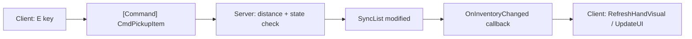

# RAPPORT D'AUDIT TECHNIQUE -- PROJET PZK

**Scope** : 18 scripts projet dans `Assets/Scripts/` (Mirror framework exclu de l'audit).
**Unity** : 6000.3.7f1 | **Rendering** : URP | **Networking** : Mirror LTS (KCP/Telepathy)

---

## 1. ARCHITECTURE RESEAU (Mirror)

### 1.1 Flux Command / Server / ClientRpc

Le projet ne contient **aucun `[ClientRpc]`**. Toute synchronisation visuelle passe par `SyncVar` hooks et `SyncList` callbacks. Ce choix est viable tant que les mises a jour restent limitees a des etats simples, mais deviendra limitant pour des effets ponctuels (animations de degats, sons spatiaux networked, etc.).

**Constat du flux actuel :**




### 1.2 Failles de securite reseau

#### CRITIQUE -- `PickupItem.CmdPickup` ([PickupItem.cs](Assets/Scripts/Item/PickupItem.cs) L46-52)

```csharp
[Command(requiresAuthority = false)]
public void CmdPickup(NetworkIdentity pickerIdentity)
{
    if (heldByNetId != 0) return;
    netIdentity.AssignClientAuthority(pickerIdentity.connectionToClient);
    heldByNetId = pickerIdentity.netId;
}
```

- `requiresAuthority = false` : **n'importe quel client** peut invoquer cette commande.
- Aucune validation de distance, aucune verification que `pickerIdentity` correspond a l'appelant.
- Un client malveillant peut passer le `NetworkIdentity` d'un autre joueur et voler l'autorite.
- **Statut actuel** : code mort (le flux passe par `PlayerInventory.CmdPickupItem`). Risque si reconnecte.

#### HAUTE -- `PickupItem.CmdDrop` ([PickupItem.cs](Assets/Scripts/Item/PickupItem.cs) L54-60)

```csharp
[Command]
public void CmdDrop(Vector3 dropPosition)
{
    transform.position = dropPosition;
    heldByNetId = 0;
    netIdentity.RemoveClientAuthority();
}
```

- `dropPosition` envoye par le client sans aucune validation serveur.
- Permet la teleportation d'items a des coordonnees arbitraires.
- **Statut actuel** : code mort (le flux passe par `PlayerInventory.CmdDropItem`).

#### MOYENNE -- Mouvement client-autoritaire ([playerMovement.cs](Assets/Scripts/playerMovement.cs))

- `CharacterController.Move()` s'execute uniquement sur le client local (L55).
- Position synchronisee via `NetworkTransformReliable` sans validation serveur.
- Vulnerable aux speed hacks et teleportation.

#### BASSE -- Race condition SyncVar ([PickupItem.cs](Assets/Scripts/Item/PickupItem.cs) L102-107)

```csharp
private IEnumerator RetryAttach(uint netId)
{
    yield return null; // 1 seule frame
    if (NetworkClient.spawned.TryGetValue(netId, out NetworkIdentity holderIdentity))
        AttachToHolder(holderIdentity);
}
```

- Retry d'une seule frame. Si le holder n'est pas encore dans `NetworkClient.spawned`, l'objet reste detache indefiniment.

### 1.3 Validation serveur correcte

- [PlayerInventory.CmdPickupItem](Assets/Scripts/PlayerInventory.cs) (L252-293) : validation distance + null + IsHeld. **Correct.**
- [PlayerInventory.CmdDropItem](Assets/Scripts/PlayerInventory.cs) (L299-325) : validation bounds + slot vide. **Correct.**
- [PlayerInventory.AddItem](Assets/Scripts/PlayerInventory.cs) (L330-389) : `[Server]` uniquement. **Correct.**
- [itemSpawner](Assets/Scripts/itemSpawner.cs) : `[Server]` sur `SpawnInitialLoot` et `SpawnLoot`. **Correct.**

### 1.4 SyncVar / Hooks -- Evaluation


| SyncVar           | Fichier               | Hook                            | Usage visuel          | Verdict                                                           |
| ----------------- | --------------------- | ------------------------------- | --------------------- | ----------------------------------------------------------------- |
| `heldByNetId`     | PickupItem.cs:19      | `OnHeldByChanged`               | Attach/Detach correct | OK                                                                |
| `activeSlotIndex` | PlayerInventory.cs:42 | `OnActiveSlotChanged`           | `RefreshHandVisual()` | **JAMAIS MODIFIE** -- le joueur ne peut pas changer de slot actif |
| `inventorySlots`  | PlayerInventory.cs:37 | `OnInventoryChanged` (callback) | UI + Hand refresh     | OK                                                                |


### 1.5 PZKNetworkManager -- Coquille vide

[PZKNetworkManager.cs](Assets/Scripts/PZKNetworkManager.cs) herite de `MonoBehaviour`, pas de `NetworkManager`. Le fichier contient un `Start()` et `Update()` vides avec les commentaires auto-generes. **Code mort a supprimer ou a implementer.**

---

## 2. CONFORMITE CODE C# (Standards PZK)

### 2.1 Violations du typage explicite (`var`)


| Fichier                                                               | Ligne(s)          | Code                                           |
| --------------------------------------------------------------------- | ----------------- | ---------------------------------------------- |
| [Generator.cs](Assets/Scripts/House/Generator.cs)                     | 146               | `var key = (cell, dir);`                       |
| [Generator.cs](Assets/Scripts/House/Generator.cs)                     | 180, 193, 213     | `foreach (var w in floor.Walls.Values)`        |
| [Generator.cs](Assets/Scripts/House/Generator.cs)                     | 275               | `foreach (var cell in floor.EnumerateCells())` |
| [PlayerCameraController.cs](Assets/Scripts/PlayerCameraController.cs) | 243               | `var rot = Quaternion.Euler(...)`              |
| [PickupItem.cs](Assets/Scripts/Item/PickupItem.cs)                    | 123, 141, 168     | `foreach (var c in cols)`                      |
| **Total**                                                             | **9 occurrences** |                                                |


### 2.2 Membres publics sans documentation XML (`///`)

**Fichiers les plus touches :**

- [Generator.cs](Assets/Scripts/House/Generator.cs) : 10 champs publics + `GenerateHouse()` + 8 classes de donnees (`HouseData`, `FloorData`, `BSPNode`, `RoomData`, `StairData`, `WallData`) -- **~30 membres**
- [ItemData.cs](Assets/Scripts/Item/ItemData.cs) : 9 champs publics -- **0 documentation**
- [PlayerCameraController.cs](Assets/Scripts/PlayerCameraController.cs) : 20+ champs publics + 5 methodes/proprietes publiques
- [playerMovement.cs](Assets/Scripts/playerMovement.cs) : 8 champs publics (InputActions, vitesses, etc.)
- [PlayerHighlightObject.cs](Assets/Scripts/PlayerHighlightObject.cs) : 2 champs + 2 methodes publiques
- [PickupItem.cs](Assets/Scripts/Item/PickupItem.cs) : 5 champs/proprietes publiques
- [itemSpawner.cs](Assets/Scripts/itemSpawner.cs) : 3 membres publics
- [HighlightInteraction.cs](Assets/Scripts/Item/HighlightInteraction.cs) : 4 membres publics
- [ItemSlot.cs](Assets/Scripts/Item/ItemSlot.cs) : 2 champs publics
- [FallingImpact.cs](Assets/Scripts/fallingImpact.cs) : 2 champs publics
- [ItemIdentity.cs](Assets/Scripts/Item/ItemIdentity.cs) : 1 champ SyncVar public
- [InventorySlot.cs](Assets/Scripts/InventorySlot.cs) : 1 champ public (`slotIndex` documente, mais pas `ClearUI()`)

**Estimation totale : ~50+ membres publics non documentes.**

### 2.3 Code mort / inutilise


| Element                            | Fichier              | Raison                                                    |
| ---------------------------------- | -------------------- | --------------------------------------------------------- |
| `PZKNetworkManager`                | PZKNetworkManager.cs | Coquille vide, MonoBehaviour au lieu de NetworkManager    |
| `LootType` enum                    | LootType.cs          | Declare mais jamais reference                             |
| `ItemIdentity` class               | ItemIdentity.cs      | Jamais utilise dans le flux actuel                        |
| `PickupItem.CmdPickup` / `CmdDrop` | PickupItem.cs        | Remplaces par `PlayerInventory.CmdPickupItem/CmdDropItem` |
| `FallingImpact` code commente      | fallingImpact.cs     | Version NetworkBehaviour en commentaire (L27-91)          |
| `ItemTest`                         | test.cs              | Script de test -- a exclure du build                      |


---

## 3. PERFORMANCE

### 3.1 Allocations GC dans les boucles de rendu


| Fichier                                                               | Methode                                   | Ligne | Allocation         | Severite        |
| --------------------------------------------------------------------- | ----------------------------------------- | ----- | ------------------ | --------------- |
| [playerMovement.cs](Assets/Scripts/playerMovement.cs)                 | `RotateTowardsMouseCursor()` (via Update) | 206   | `new Plane(...)`   | Moyenne         |
| [PlayerCameraController.cs](Assets/Scripts/PlayerCameraController.cs) | `UpdateCameraTransform()` (LateUpdate)    | 193   | `new Vector3(...)` | Faible (struct) |
| [PlayerCameraController.cs](Assets/Scripts/PlayerCameraController.cs) | `UpdateCameraTransform()` (LateUpdate)    | 199   | `new Plane(...)`   | Moyenne         |
| [PlayerCameraController.cs](Assets/Scripts/PlayerCameraController.cs) | `ComputeFPSLocalPos()` (LateUpdate)       | 233   | `new Vector3(...)` | Faible (struct) |


**Note** : `Plane` et `Vector3` sont des structs en Unity -- pas d'allocation heap. Cependant, `new Plane()` + `Raycast()` a chaque frame en ISO aim est un pattern a surveiller pour la readability et la maintenance.

### 3.2 GetComponent dans Update


| Fichier                                               | Methode                   | Ligne | Appel                                     | Impact                                                                                                       |
| ----------------------------------------------------- | ------------------------- | ----- | ----------------------------------------- | ------------------------------------------------------------------------------------------------------------ |
| [playerMovement.cs](Assets/Scripts/playerMovement.cs) | `HandleInputs()` (Update) | 95    | `GetComponentInParent<NetworkIdentity>()` | **Moyen** -- appele a chaque pression de E uniquement (`wasPressedThisFrame`), pas chaque frame. Acceptable. |


### 3.3 Camera.main dans Update


| Fichier                                                                | Methode       | Ligne | Impact                                                                                                                                                             |
| ---------------------------------------------------------------------- | ------------- | ----- | ------------------------------------------------------------------------------------------------------------------------------------------------------------------ |
| [PlayerHighlightObject.cs](Assets/Scripts/PlayerHighlightObject.cs)    | `Update()`    | 44    | `Camera.main` chaque frame en mode ISO. Dans Unity 2020+, la propriete est cachee, mais pre-2020 c'est un `FindObjectOfType`. Sous Unity 6000.x : **negligeable**. |
| [HighlightInteraction.cs](Assets/Scripts/Item/HighlightInteraction.cs) | `Update()`    | 70    | Meme pattern.                                                                                                                                                      |
| [HighlightInteraction.cs](Assets/Scripts/Item/HighlightInteraction.cs) | `Highlight()` | 41    | `Camera.main` a chaque changement de cible.                                                                                                                        |


### 3.4 LINQ en runtime


| Fichier                                                 | Methode         | Ligne   | Usage                                                                                                                                                                                                                           |
| ------------------------------------------------------- | --------------- | ------- | ------------------------------------------------------------------------------------------------------------------------------------------------------------------------------------------------------------------------------- |
| [ItemDB.cs](Assets/Scripts/Item/ItemDB.cs)              | `GetItemById()` | 16      | `allItems.FirstOrDefault(i => i.itemId == id)` -- allocation lambda + enumeration a chaque appel. Appele depuis `[Server] AddItem`, `CmdDropItem`, `RefreshHandVisual`. **Remplacer par un `Dictionary<int, ItemData>` cache.** |
| [PlayerInventory.cs](Assets/Scripts/PlayerInventory.cs) | `Start()`       | 141-142 | `Resources.FindObjectsOfTypeAll<GameObject>().FirstOrDefault(...)` -- **allocation massive** (enumere TOUS les GameObjects charges). Appele une seule fois au Start, acceptable mais fragile.                                   |


### 3.5 RefreshCursorState chaque frame

[PlayerUIController.cs](Assets/Scripts/PlayerUIController.cs) L44-49 : `RefreshCursorState()` appele dans `Update()` a chaque frame. Set `Cursor.lockState`, `Cursor.visible`, et `SetActive()` a chaque frame. **Devrait etre event-driven** (appele uniquement sur changement d'etat).

---

## 4. MIRROR LTS -- UTILISATION DU FRAMEWORK

### 4.1 NetworkManager

- Le projet utilise le `NetworkManager` par defaut de Mirror (depuis la scene).
- `PZKNetworkManager.cs` n'herite PAS de `NetworkManager` et ne contient aucune logique.
- **Pas de `OnServerAddPlayer` custom** : spawning par defaut avec round-robin des `NetworkStartPosition`.
- **Pas de gestion de deconnexion custom** : si un joueur tient un objet (ancien systeme `PickupItem`) et se deconnecte, l'objet reste en etat `heldByNetId != 0` sans cleanup.

### 4.2 Spawn des objets

- [itemSpawner.cs](Assets/Scripts/itemSpawner.cs) : `NetworkServer.Spawn()` correct dans `[Server]`. Pattern `ForceNonKinematic` via coroutine d'une frame -- fonctionnel mais fragile.
- [PlayerInventory.CmdDropItem](Assets/Scripts/PlayerInventory.cs) L312-315 : `Instantiate` + `NetworkServer.Spawn` dans un `[Command]`. **Correct.**
- **Manque** : les prefabs drops doivent etre enregistres dans la liste `Registered Spawnable Prefabs` du NetworkManager sinon erreur au spawn.

### 4.3 Singleton pattern sur composant reseau

- [itemSpawner.cs](Assets/Scripts/itemSpawner.cs) L7 : `public static itemSpawner Instance;` set dans `Awake()` sans protection. Fonctionne si un seul spawner existe, mais fragile en cas de rechargement de scene.
- [HighlightInteraction.cs](Assets/Scripts/Item/HighlightInteraction.cs) L6 : meme pattern avec `Destroy(gameObject)` si doublon -- plus robuste.

### 4.4 Localite (isLocalPlayer)

Tous les scripts joueur verifient correctement `isLocalPlayer` avant d'executer la logique client :

- `playerMovement.cs` : L46, L55
- `PlayerCameraController.cs` : L111
- `PlayerHighlightObject.cs` : L38
- `PlayerUIController.cs` : L19, L46
- `PlayerInventory.cs` : L56, L126, L213

### 4.5 Conventions de nommage Mirror


| Script           | Probleme                                                                                                                         |
| ---------------- | -------------------------------------------------------------------------------------------------------------------------------- |
| `itemSpawner`    | Nom de classe en camelCase au lieu de PascalCase (`ItemSpawner`)                                                                 |
| `playerMovement` | Nom de fichier en camelCase (`playerMovement.cs`) mais classe en PascalCase (`PlayerMovement`) -- **incoherence fichier/classe** |
| `fallingImpact`  | Meme probleme : fichier `fallingImpact.cs`, classe `FallingImpact`                                                               |
| `test.cs`        | Fichier `test.cs`, classe `ItemTest` -- incoherence                                                                              |


---

## 5. LISTE DE PRIORITES

### Quick Wins (< 1h chacun)

1. **Supprimer ou proteger `PickupItem.CmdPickup` et `CmdDrop`** -- Code mort dangereux. Soit supprimer, soit ajouter `[Obsolete]` avec validation stricte. Impact : securite critique.
2. **Remplacer LINQ dans `ItemDatabase.GetItemById`** par un `Dictionary<int, ItemData>` initialise dans `OnEnable()`. Impact : performance serveur.
3. **Rendre `RefreshCursorState()` event-driven** -- Appeler uniquement sur changement d'etat (transition ISO/FPS, toggle inventaire) au lieu de chaque frame. Impact : performance client.
4. **Supprimer `PZKNetworkManager.cs`** ou le faire heriter de `NetworkManager` avec un `OnServerDisconnect` override pour cleanup les items tenus. Impact : robustesse reseau.
5. **Supprimer le code mort** : `LootType.cs`, `ItemIdentity.cs`, le bloc commente dans `fallingImpact.cs`, `test.cs`. Impact : proprete codebase.
6. **Harmoniser les noms de fichiers** : `itemSpawner.cs` -> `ItemSpawner.cs`, `playerMovement.cs` -> `PlayerMovement.cs`, `fallingImpact.cs` -> `FallingImpact.cs`, `test.cs` -> `ItemTest.cs`. Impact : conventions.

### Refactoring moyen (1-4h chacun)

1. **Implementer `CmdSetActiveSlot(int index)`** -- Le `SyncVar activeSlotIndex` n'est jamais modifie. Ajouter un Command avec validation (bornes 0..inventorySize-1) + raccourcis clavier 1-9. Impact : gameplay.
2. **Remplacer toutes les occurrences de `var`** (9 occurrences) par des types explicites. Impact : conformite standards PZK.
3. **Ajouter les commentaires XML** sur tous les membres publics (~50+ membres). Impact : conformite standards PZK.
4. **Ajouter un retry loop robuste** dans `PickupItem.RetryAttach` (3-5 tentatives avec delai croissant). Impact : stabilite visuelle.
5. **Cacher `Camera.main`** dans un champ prive pour `PlayerHighlightObject` et `HighlightInteraction`. Impact : bonne pratique (mineur en Unity 6000.x).

### Refactoring lourd (4h+)

1. **Validation serveur du mouvement** -- Implementer une validation anti-cheat basique (vitesse max, teleportation detection) dans un `PZKNetworkManager` custom heritant de `NetworkManager`. Impact : securite reseau.
2. **Creer un `PZKNetworkManager : NetworkManager`** avec override de `OnServerAddPlayer`, `OnServerDisconnect` pour gerer le lifecycle joueur (cleanup inventaire, items tenus). Impact : architecture reseau.
3. **Migrer le generateur procedural** (`Generator.cs`) vers un systeme network-aware si les maisons doivent etre identiques sur tous les clients (seed serveur + `[ClientRpc]`). Impact : architecture gameplay.
4. **Implementer `[ClientRpc]`** pour les effets ponctuels : sons d'impact, feedbacks visuels de ramassage/drop, notifications. Impact : experience joueur.

